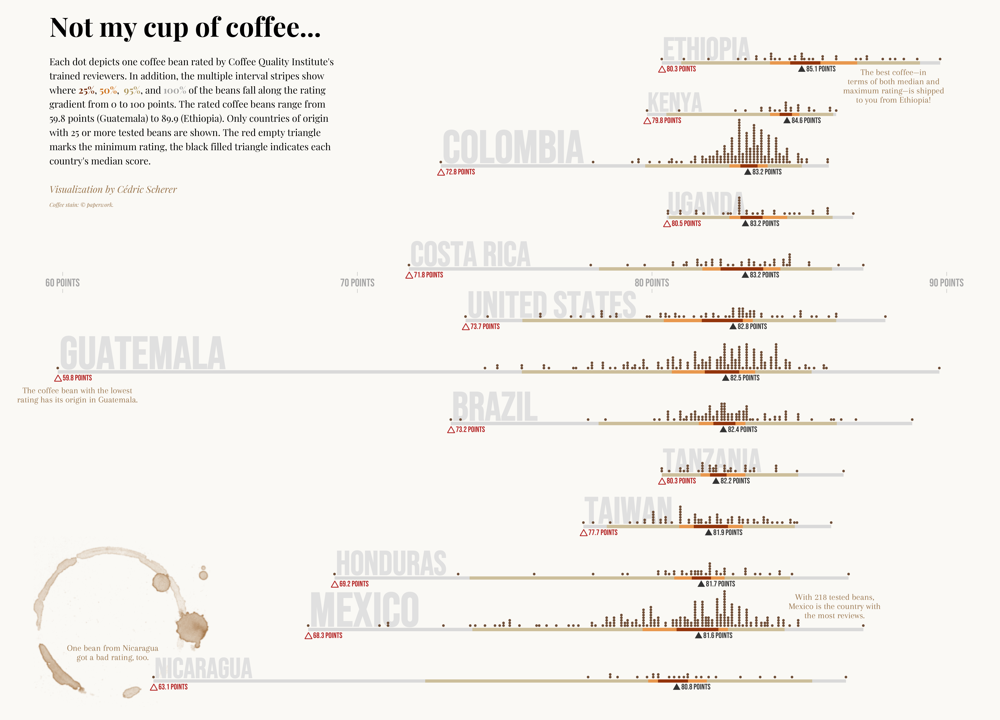

```{r setup, include=FALSE}
library(knitr)
library(magrittr)
options(htmltools.dir.version = FALSE)

opts_chunk$set(echo = FALSE, fig.align = "center", warning = FALSE, message = FALSE)

hook_source <- knitr::knit_hooks$get("source")
knitr::knit_hooks$set(source = function(x, options) {
  x <- stringr::str_replace(x, "^[[:blank:]]?([^*].+?)[[:blank:]]*#<<[[:blank:]]*$", "*\\1")
  hook_source(x, options)
})

knitr::opts_template$set(code_plot_side = list(
  fig.show = "hide", cache = TRUE, echo = TRUE
),
code_plot_dontshow = list(
  fig.show = "hide", cache = TRUE
))
```

```{r xaringan-themer, include=FALSE, warning=FALSE}
library(xaringanthemer)
style_duo_accent(
  primary_color = "#316093",
  secondary_color = "#dd99ba",
  text_slide_number_font_size = "0em",
  inverse_header_color = "#FFFFFF"
)
```


# `r emo::ji("wave")`

---

class: center, middle, inverse

# why aRt?


---
background-image: url("art/brain.jpg")

---
background-image: url("keyboard.jpeg")

---
background-image: url("art/brain-no.jpg")

---

### U can do both

--

### Digital art is fast, iterative, surprising

--

### Less "I suck at this" beginner hurdles

--

### No startup cost

--

### I <3 R

---
class: inverse, middle, center

# Pixel Art

---
class: middle

.left-lil[
```{r}
include_graphics(c("art/katie-segreti-ghost.jpg"))
```

[Katie Segretti](https://twitter.com/katiesegreti) (via [@WeAreRLadies](https://twitter.com/WeAreRLadies/status/1291359584179957762))
]

.right-big[
```{r}
include_graphics(c("art/coolbutuseless-arcade.png"))
```

[@coolbutuseless](https://coolbutuseless.github.io/2020/05/04/introducing-arcadefont-an-oldschool-arcade-vector-font-happy-star-wars-day/)
]

---

.left-sixtyfive[
```{r smile-1, opts.label = "code_plot_side"}
library(ggplot2)
library(dplyr)

smile <- expand.grid(x = 1:8, y = 1:8) %>%
  filter(!(x %in% c(1, max(x)) & y %in% c(1, max(y)))) %>%
  filter(!(x %in% c(2, max(x) - 1) & y %in% c(1, max(y)))) %>%
  filter(!(x %in% c(1, max(x)) & y %in% c(2, max(y) - 1)))

ggplot() +
  geom_tile(
    data = smile, aes(x = x, y = y), width = 1, height = 1,
    size = 1, fill = "yellow", colour = "black"
  ) +
  coord_equal() +
  theme_void()
```
]

--

.right-thirtyfive[
```{r}
include_graphics(fig_chunk("smile-1", "png"))
```
]

---

.left-sixtyfive[
```{r smile-2, opts.label = "code_plot_side"}
library(ggplot2)
library(dplyr)

smile <- expand.grid(x = 1:8, y = 1:8) %>%
  filter(!(x %in% c(1, max(x)) & y %in% c(1, max(y)))) %>%
  filter(!(x %in% c(2, max(x) - 1) & y %in% c(1, max(y)))) %>%
  filter(!(x %in% c(1, max(x)) & y %in% c(2, max(y) - 1)))

eyes <- data.frame(x = c(3, 6), y = c(6, 6)) #<<

ggplot() +
  geom_tile(
    data = smile, aes(x = x, y = y), width = 1, height = 1,
    size = 1, fill = "yellow", colour = "black"
  ) +
  geom_tile(  #<<
    data = eyes, aes(x = x, y = y), width = 1, height = 1,  #<<
    fill = "black", colour = "black"   #<<
  ) +  #<<
  coord_equal() +
  theme_void()
```
]

.right-thirtyfive[
```{r}
include_graphics(fig_chunk("smile-2", "png"))
```
]
---

.left-sixtyfive[
```{r smile-3, echo = TRUE}
library(ggplot2)
library(dplyr)

smile <- expand.grid(x = 1:8, y = 1:8) %>%
  filter(!(x %in% c(1, max(x)) & y %in% c(1, max(y)))) %>%
  filter(!(x %in% c(2, max(x) - 1) & y %in% c(1, max(y)))) %>%
  filter(!(x %in% c(1, max(x)) & y %in% c(2, max(y) - 1)))

eyes <- data.frame(x = c(3, 6), y = c(6, 6))

mouth <- data.frame(x = 3:6, y = c(3, 2, 2, 3))  #<<

ggplot() +
  geom_tile(
    data = smile, aes(x = x, y = y), width = 1, height = 1,
    size = 1, fill = "yellow", colour = "black"
  ) +
  geom_tile(
    data = eyes, aes(x = x, y = y), width = 1, height = 1,
    fill = "black", colour = "black"
  ) +
  geom_tile( #<<
    data = mouth, aes(x = x, y = y), width = 1, height = 1, #<<
    fill = "black", colour = "black" #<<
  ) + #<<
  coord_equal() +
  theme_void()
```
]

.right-thirtyfive[
```{r}
include_graphics(fig_chunk("smile-3", "png"))
```
]
---
class: center, inverse, middle

# Rendering

### Recreating an image (realistic or not) from a 2D or 3D model, via a computer program.

---
class: middle

```{r, fig.width = 10, fig.height = 4, dpi = 300}
library(ggkeyboard)
ggkeyboard()
```

[Sharla Gelfand](https://github.com/sharlagelfand/ggkeyboard)

---
class: middle

```{r, out.width = "80%"}

```

[Sarah L. Fossheim (CSS)](https://twitter.com/liatrisbian/status/1287475889089982469)

---
class: middle

.pull-left[
```{r, dpi = 100}
include_graphics("art/tyler-morgan-wall-depth.png")
```
]

.pull-right[
```{r, dpi = 100}
include_graphics("art/tyler-morgan-wall-ggplot-glass.png")
```
]

[Tyler Morgan-Wall](https://www.tylermw.com/)
---

.left-biggish[
```{r, echo = TRUE, eval = FALSE}
library(rayrender)

generate_ground(
  material = diffuse(color = "#dd99ba")
  ) %>%
  render_scene()
```

```{r rayrender-1, opts.label = "code_plot_dontshow"}
library(rayrender)

generate_ground(
  material = diffuse(color = "#dd99ba")
  ) %>%
  render_scene(progress = FALSE)
```
]

--

.right-lillish[
```{r}
include_graphics(fig_chunk("rayrender-1", "png"))
```
]

???

Uses ray tracing, a rendering technique for generating images that realistically simulated how light falls on 3D models.
---


.left-biggish[
```{r,  echo = TRUE, eval = FALSE}
library(rayrender)

generate_ground(
  material = diffuse(color = "#dd99ba")
  ) %>%
  add_object(sphere( #<<
    material = diffuse(color = "#99badd") #<<
  )) %>%  #<<
  render_scene()
```

```{r rayrender-2, opts.label = "code_plot_dontshow"}
library(rayrender)

generate_ground(
  material = diffuse(color = "#dd99ba")
  ) %>%
  add_object(sphere( #<<
    material = diffuse(color = "#99badd") #<<
  )) %>%  #<<
  render_scene(progress = FALSE)
```
]

.right-lillish[
```{r}
include_graphics(fig_chunk("rayrender-2", "png"))
```
]

---

.left-biggish[
```{r,  echo = TRUE, eval = FALSE}
library(rayrender)

generate_ground(
  material = diffuse(color = "#dd99ba")
  ) %>%
  add_object(sphere(
    material = diffuse(color = "#99badd")
  )) %>%
  render_scene(
    fov = 40 #<<
  )
```

```{r rayrender-3, opts.label = "code_plot_dontshow"}
library(rayrender)

generate_ground(
  material = diffuse(color = "#dd99ba")
  ) %>%
  add_object(sphere(
    material = diffuse(color = "#99badd")
  )) %>%
  render_scene(
    fov = 40,
    progress = FALSE
  )
```
]

.right-lillish[
```{r}
include_graphics(fig_chunk("rayrender-3", "png"))
```
]

---

.left-biggish[
```{r,  echo = TRUE, eval = FALSE}
library(rayrender)

generate_ground(
  material = diffuse(color = "#dd99ba")
  ) %>%
  add_object(sphere(
    material = diffuse(color = "#99badd")
  )) %>%
  add_object(sphere( #<<
    x = 2, radius = 0.5, #<<
    material = dielectric(color = "#badd99") #<<
  )) %>% #<<
  render_scene(
    fov = 40
  )
```

```{r rayrender-4, opts.label = "code_plot_dontshow"}
library(rayrender)

generate_ground(
  material = diffuse(color = "#dd99ba")
  ) %>%
  add_object(sphere(
    material = diffuse(color = "#99badd")
  )) %>%
  add_object(sphere( #<<
    x = 2, radius = 0.5, #<<
    material = dielectric(color = "#badd99") #<<
  )) %>% #<<
  render_scene(
    fov = 40,
    progress = FALSE
  )
```
]

.right-lillish[
```{r}
include_graphics(fig_chunk("rayrender-4", "png"))
```
]
---

.left-biggish[
```{r, echo = TRUE, eval = FALSE}
library(rayrender)

generate_ground(
  material = diffuse(color = "#dd99ba")
  ) %>%
  add_object(sphere(
    material = diffuse(color = "#99badd")
  )) %>%
  add_object(sphere(
    x = 2, radius = 0.5,
    material = dielectric(color = "#badd99")
  )) %>%
  add_object(cube( #<<
    x = -2, z = -1, width = 1, #<<
    material = metal(color = "#99ddba") #<<
  )) %>% #<<
  render_scene(
    fov = 40
  )
```

```{r rayrender-5, opts.label = "code_plot_dontshow"}
library(rayrender)

generate_ground(
  material = diffuse(color = "#dd99ba")
  ) %>%
  add_object(sphere(
    material = diffuse(color = "#99badd")
  )) %>%
  add_object(sphere(
    x = 2, radius = 0.5,
    material = dielectric(color = "#badd99")
  )) %>%
  add_object(cube( #<<
    x = -2, z = -1, width = 1, #<<
    material = metal(color = "#99ddba") #<<
  )) %>% #<<
  render_scene(
    fov = 40,
    progress = FALSE
  )
```
]

.right-lillish[
```{r}
include_graphics(fig_chunk("rayrender-5", "png"))
```
]

---

.left-biggish[
```{r,  echo = TRUE, eval = FALSE}
library(rayrender)

generate_ground(
  material = diffuse(color = "#dd99ba")
  ) %>%
  add_object(sphere(
    material = diffuse(color = "#99badd")
  )) %>%
  add_object(sphere(
    x = 2, radius = 0.5,
    material = dielectric(color = "#badd99")
  )) %>%
  add_object(cube(
    x = -2, z = -1, width = 1,
    material = metal(color = "#99ddba")
  )) %>%
  add_object(pig( #<<
    y = 1, z = 1, #<<
    scale = 0.4, angle = c(0, -60, 0) #<<
  )) %>% #<<
  render_scene(
    fov = 40
  )
```

```{r rayrender-6, opts.label = "code_plot_dontshow"}
library(rayrender)

generate_ground(
  material = diffuse(color = "#dd99ba")
  ) %>%
  add_object(sphere(
    material = diffuse(color = "#99badd")
  )) %>%
  add_object(sphere(
    x = 2, radius = 0.5,
    material = dielectric(color = "#badd99")
  )) %>%
  add_object(cube(
    x = -2, z = -1, width = 1,
    material = metal(color = "#99ddba")
  )) %>%
  add_object(pig( #<<
    y = 1, z = 1, #<<
    scale = 0.4, angle = c(0, -60, 0) #<<
  )) %>% #<<
  render_scene(
    fov = 40,
    progress = FALSE
  )
```
]

.right-lillish[
```{r}
include_graphics(fig_chunk("rayrender-6", "png"))
```
]

---

.left-biggish[

```{r, echo = TRUE, eval = FALSE}
library(rayrender)

generate_ground(
  material = diffuse(color = "#dd99ba")
  ) %>%
  add_object(sphere(
    material = diffuse(color = "#99badd")
  )) %>%
  add_object(sphere(
    x = 2, radius = 0.5,
    material = dielectric(color = "#badd99")
  )) %>%
  add_object(cube(
    x = -2, z = -1, width = 1,
    material = metal(color = "#99ddba")
  )) %>%
  add_object(pig(
    y = 1, z = 1,
    scale = 0.4, angle = c(0, -60, 0)
  )) %>%
  render_scene(
    fov = 40,
    lookfrom = c(-1, 4, 0) #<<
  )
```

```{r rayrender-7, opts.label = "code_plot_dontshow"}
library(rayrender)

generate_ground(
  material = diffuse(color = "#dd99ba")
  ) %>%
  add_object(sphere(
    material = diffuse(color = "#99badd")
  )) %>%
  add_object(sphere(
    x = 2, radius = 0.5,
    material = dielectric(color = "#badd99")
  )) %>%
  add_object(cube(
    x = -2, z = -1, width = 1,
    material = metal(color = "#99ddba")
  )) %>%
  add_object(pig(
    y = 1, z = 1,
    scale = 0.4, angle = c(0, -60, 0)
  )) %>%
  render_scene(
    fov = 40,
    lookfrom = c(-1, 4, 0),
    progress = FALSE
  )
```
]

.right-lillish[
```{r}
include_graphics(fig_chunk("rayrender-7", "png"))
```
]

---
class: inverse, middle, center

# Generative art

### "Generative art is art programmed using a computer that intentionally introduces randomness as part of its creation process." - [Why Love Generative Art?](https://www.artnome.com/news/2018/8/8/why-love-generative-art)

---

# Generative art

The environment is constrained, but decisions are made randomly, rather than by the artist.

.pull-left[
```{r circle-1, opts.label = "code_plot_side"}
library(ggplot2)
library(ggforce)

n <- 5

ggplot() +
  geom_circle(aes(
    x0 = rnorm(n),
    y0 = rnorm(n),
    r = runif(n)
  )) +
  theme_void()
```
]

.pull-right[
```{r, out.width = "80%"}
include_graphics(fig_chunk("circle-1", "png"))
```
]

---

# Generative art

Additional complexity doesn't mean additional time or effort.

.pull-left[
```{r circle-2, opts.label = "code_plot_side"}
library(ggplot2)
library(ggforce)

n <- 100 #<<

ggplot() +
  geom_circle(aes(
    x0 = rnorm(n),
    y0 = rnorm(n),
    r = runif(n)
  )) +
  theme_void()
```
]

.pull-right[
```{r, out.width = "80%"}
include_graphics(fig_chunk("circle-2", "png"))
```
]

---
class: middle

.pull-left[
```{r, out.width = "100%"}

```

[Danielle Navarro](https://art.djnavarro.net)
]

.pull-right[
```{r}

```
]

---

# [`generativeart`](https://github.com/cutterkom/generativeart) package

```{r, eval = FALSE}
# Setup required for generativeart
IMG_DIR <- "img/"
IMG_SUBDIR <- "everything/"
IMG_SUBDIR2 <- "handpicked/"
IMG_PATH <- paste0(IMG_DIR, IMG_SUBDIR)

LOGFILE_DIR <- "logfile/"
LOGFILE <- "logfile.csv"
LOGFILE_PATH <- paste0(LOGFILE_DIR, LOGFILE)
# create the directory structure
generativeart::setup_directories(IMG_DIR, IMG_SUBDIR, IMG_SUBDIR2, LOGFILE_DIR)
```

.left-biggish[
```{r, opts.label = "code_plot_side", eval = FALSE}
library(generativeart)

formula <- list(
  x = quote(rnorm(5) * x_i - cos(y_i^2)),
  y = quote(rnorm(5) * y_i^2 + sin(x_i))
)

generate_img(
  formula = formula,
  polar = FALSE,
  nr_of_img = 1
)
```
]

--

.right-lillish[
```{r}

```
]

---

# [`generativeart`](https://github.com/cutterkom/generativeart) package

.left-biggish[
```{r generativeart-2, opts.label = "code_plot_side", eval = FALSE}
library(generativeart)

formula <- list(
  x = quote(rnorm(5) * x_i - cos(y_i^2)),
  y = quote(rnorm(5) * y_i^2 + sin(x_i))
)

generate_img(
  formula = formula,
  polar = TRUE, #<<
  nr_of_img = 2 #<<
)
```

Seed: 2917
]

.right-lillish[
```{r}

```
]

---

# [`generativeart`](https://github.com/cutterkom/generativeart) package

.left-biggish[
```{r, opts.label = "code_plot_side", eval = FALSE}
<<generativeart-2>>
```

Seed: 3553
]

.right-lillish[
```{r}

```
]

---

# [`generativeart`](https://github.com/cutterkom/generativeart) package

.left-biggish[
```{r, opts.label = "code_plot_side", eval = FALSE}
library(generativeart)

formula <- list(
  x = quote(runif(5) * x_i - cos(y_i^2)), #<<
  y = quote(rnorm(5) * y_i^2 + sin(x_i))
)

generate_img(
  formula = formula,
  polar = TRUE,
  nr_of_img = 1, 
  color = "red" #<<
)
```
]
.right-lillish[
```{r}

```
]

---

# [`flametree` package](https://github.com/djnavarro/flametree/)

.left-biggish[
```{r flametree-1, opts.label = "code_plot_side"}
library(flametree)

flametree_grow(
  seed = 1234,
  time = 1,
  split = 2
) %>%
  flametree_plot()
```
]

.right-lillish[
```{r}
  include_graphics(fig_chunk("flametree-1", "png"))
```
]

---
# [`flametree` package](https://github.com/djnavarro/flametree/)
  
.left-biggish[
```{r flametree-2, opts.label = "code_plot_side"}
library(flametree)

flametree_grow(
  seed = 1234,
  time = 2, #<<
  split = 2
) %>%
  flametree_plot()
```
  ]

.right-lillish[
```{r}
include_graphics(fig_chunk("flametree-2", "png"))
```
]

---
# [`flametree` package](https://github.com/djnavarro/flametree/)
  
.left-biggish[
```{r flametree-3, opts.label = "code_plot_side"}
library(flametree)

flametree_grow(
  seed = 1234,
  time = 2,
  split = 4 #<<
) %>%
  flametree_plot()
```
  ]

.right-lillish[
```{r}
include_graphics(fig_chunk("flametree-3", "png"))
```
]

---
# [`flametree` package](https://github.com/djnavarro/flametree/)
  
.left-biggish[
```{r flametree-4, opts.label = "code_plot_side"}
library(flametree)

flametree_grow(
  seed = 1234,
  time = 5, #<<
  split = 4 
) %>%
  flametree_plot(
    background = "pink", #<<
    palette = "ggthemes::Classic Red-Green Light" #<<
)
```
  ]

.right-lillish[
```{r}
include_graphics(fig_chunk("flametree-4", "png"))
```
]

---

# [`jasmines` package](https://github.com/djnavarro/jasmines)

.left-biggish[
```{r jasmines, opts.label = "code_plot_side"}
library(jasmines)

use_seed(1234) %>%
  entity_lissajous(
    grain = 1000,
    size = 0.1
  ) %>%
  unfold_warp(iterations = 50) %>%
  style_ribbon(
    palette = "oslo",
    background = "pink"
  )
```

]
.right-lillish[
```{r}
include_graphics(fig_chunk("jasmines", "png"))
```
]

---

# [`jasmines`](https://github.com/djnavarro/jasmines) package

.left-biggish[
```{r jasmines-2, opts.label = "code_plot_side", }
library(jasmines)

use_seed(1234) %>%
  entity_lissajous(
    grain = 1000,
    size = 0.1
  ) %>%
  unfold_warp(iterations = 10) %>% #<<
  style_ribbon(
    palette = "oslo",
    background = "pink"
  )
```
]
.right-lillish[
```{r}
include_graphics(fig_chunk("jasmines-2", "png"))
```
]

---

# [`jasmines`](https://github.com/djnavarro/jasmines) package

.left-biggish[
```{r jasmines-3, opts.label = "code_plot_side"}
library(jasmines)

use_seed(1234) %>%
  entity_lissajous(
    grain = 1000,
    size = 0.1
  ) %>%
  unfold_warp(iterations = 10) %>%
  style_ribbon(
    palette = "rainbow", #<<
    background = "black" #<<
  )
```
]

.right-lillish[
```{r}
include_graphics(fig_chunk("jasmines-3", "png"))
```
]

---

.left-big[
```{r, out.width = "100%"}

```
]

.right-lil[
### "For me, the sweet spot of generative art lies in creating a system that you know well enough to set it up for success, but is so complex that you still get surprised when you see the result."
]

[Thomas Lin Pedersen](https://www.data-imaginist.com/art)

---

# Everything else I didn't have time to talk about

---

```{r, out.width = "75%"}

```

[Cédric Scherer](https://twitter.com/CedScherer)

---

```{r, out.width = "50%"}

```

[Ryan Timpe](https://twitter.com/ryantimpe/status/1280241868123627521)

---

```{r, out.width = "66%"}

```

[Allison Horst](https://github.com/allisonhorst/stats-illustrations)

---

```{r, out.width = "66%"}

```

[Allison Horst](https://github.com/allisonhorst/stats-illustrations)

---

---

# Thank you!

@sharlagelfand

bit.ly/artstats

## Links:

[`rayshader`:]

[`ambient`: A Generator of Multidimensional Noise](https://ambient.data-imaginist.com)

[12 Months of aRt (Will Chase)](https://www.williamrchase.com/work/art/)

[Fronkonstin (Antonio Sánchez Chinchón)](https://fronkonstin.com/)

[Experiments in Generative Art with RStats](https://www.aamlai.com/2020/05/27/experiments-in-generative-art-with-rstats/)
